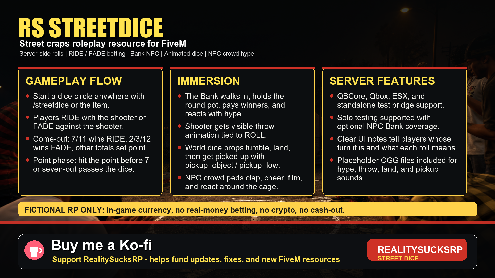
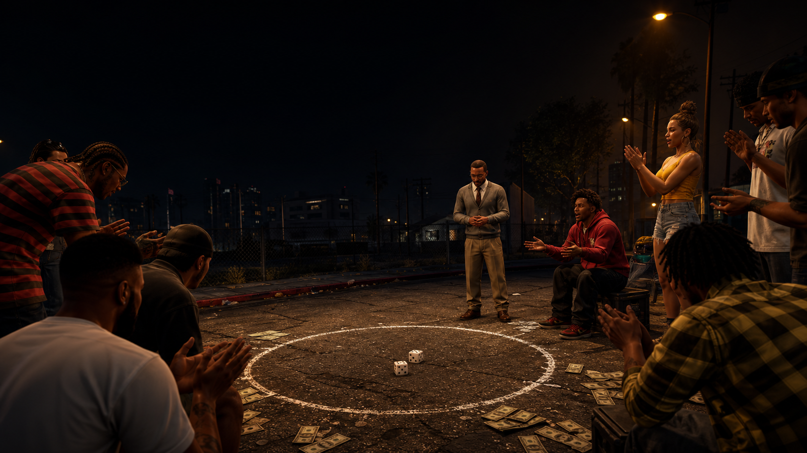

# rs-streetdice v0.3.19-test

[](https://ko-fi.com/realitysucksrp)

**Support RealitySucksRP:** [https://ko-fi.com/realitysucksrp](https://ko-fi.com/realitysucksrp)



RS StreetDice is a mobile street craps roleplay resource for FiveM. Players can start a dice circle almost anywhere, wait for The Bank to walk in, place RIDE or FADE action, and shoot server-authoritative dice with visible animations, crowd reactions, and clear UI guidance.

This resource is for fictional roleplay using in-game currency only. It is not intended for real-life gambling, real-money betting, cryptocurrency wagering, cash-out systems, or illegal gambling activity.

--------------------------------------------------------------

## Gameplay

1. A player uses `/streetdice` or the `streetdice` item to start a circle.
2. The Bank NPC walks to the scene and acts as the round pot holder.
3. Players join the circle through the Bank prompt or `/sdjoin`.
4. The shooter must RIDE with their own roll.
5. Other players can FADE against the shooter.
6. When action is covered, the shooter presses ROLL.
7. The shooter turns, throws, the UI dice tumble, and physical dice props spawn when a valid dice prop model is available.
8. The Bank calls the result, pays winners, and the UI explains the outcome.

The UI is built to guide players who do not already know street dice. It shows whose turn it is, whether action is covered, what the point means, and whether the player won, lost, pushed, or watched the winning side.

--------------------------------------------------------------

## Dice Rules

- Come-out roll 7 or 11: RIDE wins.
- Come-out roll 2, 3, or 12: FADE wins.
- Any other come-out total becomes the point.
- In point phase, RIDE wants the shooter to hit the point again.
- In point phase, FADE wants a 7 before the point.
- Seven-out passes dice to the next joined player when enabled.
- Come-out craps can also pass dice when enabled.

Street dice varies by community, so the config keeps key behavior adjustable.

--------------------------------------------------------------

## Feature Set

- Server-side dice rolls.
- RIDE / FADE betting model.
- Bank NPC walk-in, hype, pot handling, and payout.
- Optional NPC Bank coverage for solo or small scenes.
- Clear player guidance notes in the UI.
- Animated NUI dice that tumble every roll.
- Player throw animation tied directly to ROLL.
- Physical dice props with pickup animation when a dice model is available.
- `pickup_object` / `pickup_low` pickup animation support.
- NPC crowd peds that clap, cheer, film, and react around the circle.
- Placeholder `.ogg` files for Bank hype and dice SFX.
- QBCore, Qbox, ESX, and standalone test bridge support.

--------------------------------------------------------------

## Install

1. Add the resource to your server resources folder.
2. Add this to `server.cfg`:

```cfg
ensure rs-streetdice
```

3. If using QBCore/Qbox inventory, add the item from `install/items.lua` to your item list.
   For QBCore, paste only the item entry into `qb-core/shared/items.lua`.

```lua
streetdice = {
    name = 'streetdice',
    label = 'Street Dice',
    weight = 100,
    type = 'item',
    image = 'streetdice.png',
    unique = false,
    useable = true,
    shouldClose = true,
    combinable = nil,
    description = 'A pair of dice used to start a street dice game.'
},
```

4. Drop `install/streetdice.png` into your inventory image folder.
5. Optional: replace the empty placeholder `.ogg` files in `sounds/` with real recordings, then set `Config.Sounds.enabled = true`.
6. Restart the server. Use the item or `/streetdice` to start a game.

--------------------------------------------------------------

## Commands

```text
/streetdice              Start a dice circle
/sdjoin                  Join the nearest active circle
/sdbet [amt] [side]      Place a bet, side = with or against
/sdroll                  Shooter rolls
/sdend                   Host ends the game after bets are settled
/sdmenu                  Reopen the dice panel UI
```

--------------------------------------------------------------

## Core Config

Main settings live in `config.lua`.

```lua
Config.Money = {
    type = 'cash',
    minBet = 100,
    maxBet = 2500,
    allowNpcBankCoverage = true,
    npcBankrollPerGame = 50000
}
```

`allowNpcBankCoverage = true` lets The Bank cover missing action for solo testing or small scenes. Set it to `false` for strict player-vs-player action only.

```lua
Config.Game = {
    requireFadeToRoll = true,
    requireCoveredAction = true,
    passDiceOnSevenOut = true,
    passDiceOnComeoutCraps = true
}
```

These options keep the roll flow strict: the shooter rides, someone fades, and dice do not fly until action is covered unless Bank coverage is enabled.

--------------------------------------------------------------

## Sound Setup

The `sounds/` folder ships with empty placeholder `.ogg` files. Replace them with your own final recordings before enabling sound.

```lua
Config.Sounds = {
    enabled = false,
    volume = 0.7,
    audibleRadius = 25.0
}
```

Included sound buckets:

- Bank arriving
- Betting
- Warning
- Locked action
- Natural
- Craps
- Point
- Seven-out
- Hit point
- Payout
- Ambient crowd / Bank hype
- Dice throw
- Dice land
- Dice pickup

--------------------------------------------------------------

## Framework Support

`Config.Framework = 'auto'` detects frameworks in this order:

1. `qb-core`
2. `qbx_core`
3. `es_extended`
4. standalone fallback

Standalone mode is included for testing only. Live economy servers should use QBCore, Qbox, or ESX.

--------------------------------------------------------------

## Editable Files

- `config.lua`
- `html/index.html`
- `html/style.css`
- `html/app.js`
- `sounds/*.ogg`
- `sounds/README.txt`
- `install/items.lua`
- `install/streetdice.png`
- `README.md`

--------------------------------------------------------------

## Files

```text
rs-streetdice/
  fxmanifest.lua
  config.lua
  README.md
  client/main.lua
  server/main.lua
  artwork/
    rs-streetdice-kofi-card.png
  html/
    index.html
    style.css
    app.js
  install/
    items.lua
    streetdice.png
  sounds/
    README.txt
    *.ogg
```

--------------------------------------------------------------

## Open Source

This resource is open source. You are encouraged to study it, fork it, improve it, and build new street-dice features on top of it.

If you use this project or expand it, please credit Reality Sucks RP / William Brito and link back to the original repository when possible.

Community improvements are welcome: new UI themes, extra animations, better framework bridges, cleaner rules options, sound packs, and gameplay polish are all good directions.
