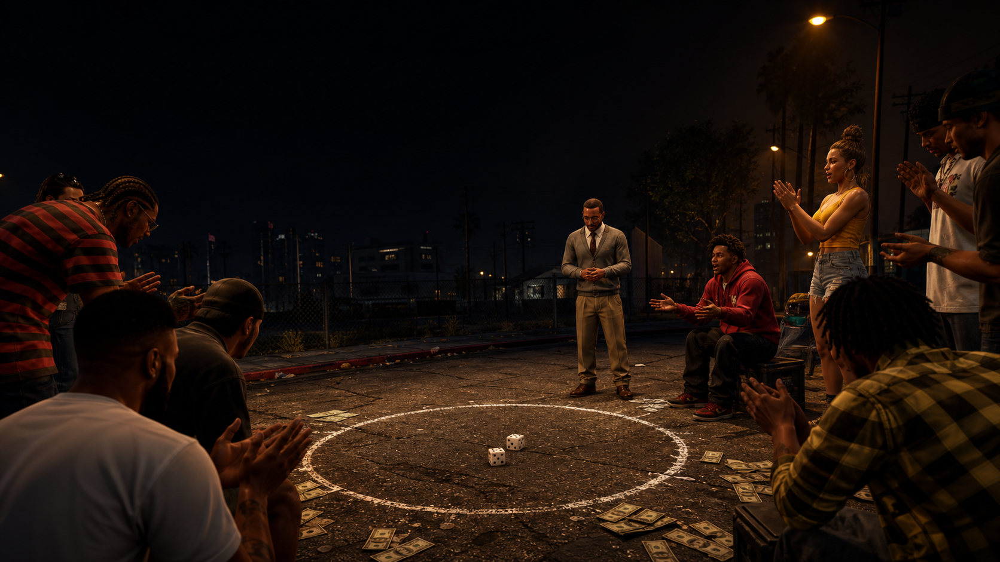
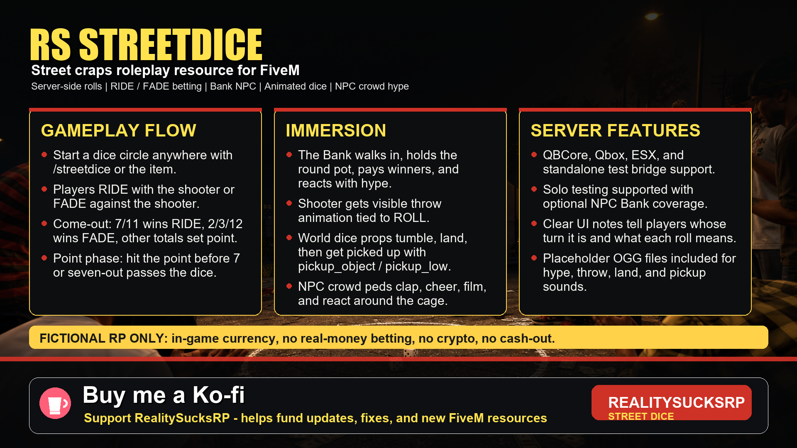

# RS StreetDice — FiveM Street Craps Roleplay

<p align="center">
  
</p>

<p align="center">
  <a href="https://github.com/RealitySucksRP/rs-streetdice-street-craps/archive/refs/heads/main.zip"></a>
  <a href="https://reality-sucks-rp-webstore.tebex.io/"></a>
  <a href="https://www.youtube.com/@RealitySucksRP"></a>
</p>

Build a pop-up street-dice scene anywhere in your FiveM city. A Bank NPC walks in to handle the action while players choose RIDE or FADE, throw animated dice and react to the live outcome. The game is designed strictly for **fictional in-game currency and roleplay**, not real-money wagering.

**[Get the free source](https://github.com/RealitySucksRP/rs-streetdice-street-craps/archive/refs/heads/main.zip)** · [RealitySucksRP Tebex store](https://reality-sucks-rp-webstore.tebex.io/) · [YouTube channel](https://www.youtube.com/@RealitySucksRP) · [Discord](https://discord.gg/e9V3rPHySx)

## At a glance

| | |
|---|---|
| Version | `0.3.19-test` (resource manifest) |
| Play style | Multiplayer street-dice roleplay with Bank NPC and RIDE / FADE sides |
| World effects | Throw animations, physical dice where supported, crowd reactions |
| Frameworks | QBCore, Qbox, ESX and standalone test mode via included detection |
| Starting a game | `/streetdice` or configured item |
| Customization | Rules, money limits, NPC Bank and optional replaceable OGG audio |
| Download | Public source via **Code → Download ZIP** (no separate release asset) |

## Artwork gallery

| StreetDice scene | Promotional artwork |
|:--:|:--:|
|  |  |

These are included repository artwork files, not claimed in-game screenshots.

## Video and store links

Browse [RealitySucksRP on YouTube](https://www.youtube.com/@RealitySucksRP) for FiveM previews and the [official Tebex store](https://reality-sucks-rp-webstore.tebex.io/) for other resources. A dedicated StreetDice YouTube preview and a dedicated Tebex product URL could not be verified, so neither is represented as an official project-specific link.

## Gameplay

1. A player uses `/streetdice` or the `streetdice` item to start a circle.
2. The Bank NPC walks to the scene and acts as the round pot holder.
3. Players join through the Bank prompt or `/sdjoin`.
4. The shooter must RIDE with their own roll.
5. Other players can FADE against the shooter.
6. When action is covered, the shooter presses ROLL.
7. The shooter throws, UI dice tumble and physical dice props spawn when available.
8. The Bank calls the result, pays winners and the UI explains the outcome.

## Dice Rules

- Come-out roll 7 or 11: RIDE wins.
- Come-out roll 2, 3 or 12: FADE wins.
- Any other come-out total becomes the point.
- In point phase, RIDE wants the shooter to hit the point again.
- In point phase, FADE wants a 7 before the point.
- Seven-out can pass dice to the next joined player when enabled.
- Come-out craps can also pass dice when enabled.

Street dice varies by community, so key behavior stays configurable.

## Features

- Server-side dice rolls
- RIDE / FADE gameplay model
- Bank NPC walk-in, hype, pot handling and payout
- Optional NPC Bank coverage for solo or small scenes
- Animated NUI dice
- Player throw animation tied to ROLL
- Physical dice props with pickup animation when supported
- NPC crowd reactions
- Configurable rules and money limits
- QBCore, Qbox, ESX and standalone test bridge support

## Install

1. Add the resource to your server resources folder.
2. Add this to `server.cfg`:

```cfg
ensure rs-streetdice
```

3. If using QBCore/Qbox inventory, add the item from `install/items.lua` to your item list.
4. Drop `install/streetdice.png` into your inventory image folder.
5. Optional: replace the placeholder `.ogg` files in `sounds/` with your own recordings before enabling sound.
6. Restart the server.

## Commands

```text
/streetdice              Start a dice circle
/sdjoin                  Join the nearest active circle
/sdbet [amt] [side]      Place an in-city RP bet
/sdroll                  Shooter rolls
/sdend                   Host ends the game after action is settled
/sdmenu                  Reopen the dice panel UI
```

## Framework Support

`Config.Framework = 'auto'` detects:

1. `qb-core`
2. `qbx_core`
3. `es_extended`
4. standalone fallback

Standalone mode is intended for testing. Live economy servers should use a supported framework.

## Open Source

This resource is open source. You are encouraged to study it, fork it, improve it and build new RP features on top of it.

If you use or expand it, please credit **RealitySucksRP** and link back to the original repository when possible.

## More RealitySucksRP projects

Browse the [RealitySucksRP Tebex store](https://reality-sucks-rp-webstore.tebex.io/), [free-script collection](https://reality-sucks-rp-webstore.tebex.io/category/free-scripts) or [RealitySucksRP YouTube videos](https://www.youtube.com/@RealitySucksRP). For support, join [Discord](https://discord.gg/e9V3rPHySx).
